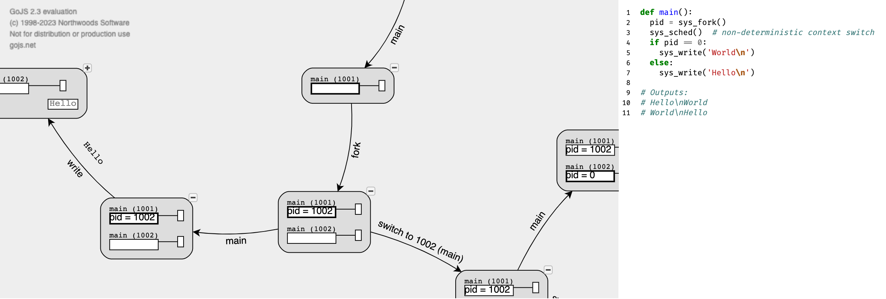

# MOSAIC Operating System Model and Checker

This is the artifact for Paper #202 of USENIX ATC'23 "The Hitchhiker’s Guide to Operating Systems". (Cherry-picked from the backend of my [course homepage](http://jyywiki.cn/OS/2023/build/lect4.ipynb).)

- [mosaic.py](mosaic.py) - The model checker (zero dependency; self-documented)
- [vis/](vis/) - The visualization script of an interactive state space explorer
- [examples/](examples/) - The code examples evaluated in the paper

## The Operating System Model

MOSAIC supports simple applications with "system calls". The program entry is `main()`:

```python
def main():
    pid = sys_fork()
    sys_sched()  # non-deterministic context switch
    if pid == 0:
        sys_write('World\n')
    else:
        sys_write('Hello\n')
```

MOSAIC can interpret these system calls, or model-check it:

    python3 mosaic.py --run foo.py
    python3 mosaic.py --check bar.py

A JSON file (state transition graph) will be printed to stdout.
The output (state transition graph) can be piped to another tool, e.g., a
visualization tool:

```bash
# quick and dirty check
python3 mosaic.py --check examples/hello.py | grep stdout | sort | uniq
```

```bash
# interactive state explorer
python3 mosaic.py --check examples/hello.py | python3 -m vis
```



## Modeled System Calls

System Call         | Behavior
--------------------|-----------------------------------------------
`sys_fork()`        | create current thread's heap and context clone
`sys_spawn(f, xs)`  | spawn a heap-sharing thread executing `f(xs)`
`sys_write(xs)`     | write string `xs` to a shared console
`sys_bread(k)`      | return the value of block id `k`
`sys_bwrite(k, v)`  | write block `k` with value `v`
`sys_sync()`        | persist all outstanding block writes
`sys_sched()`       | perform a non-deterministic context switch
`sys_choose(xs)`    | return a non-deterministic choice in `xs`
`sys_crash()`       | perform a non-deterministic crash

Limitation: system calls are implemented by `yield`. To keep the model checker minimal, one cannot perform system call in a function. (This is not a fundamental limitation and will be addressed in the future.)

## Reproducing Results

```bash
python3 examples/_reproduce.py
```

Similar results in Table 2 are expected. Tested on: Python 3.10.9 (macOS Ventura), Python 3.11.2 (Ubuntu 22.04)
